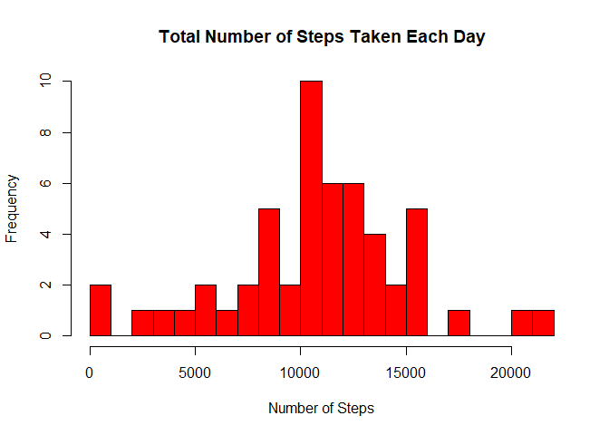
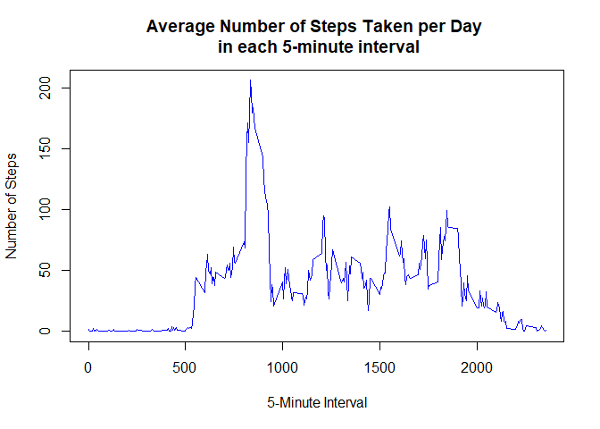
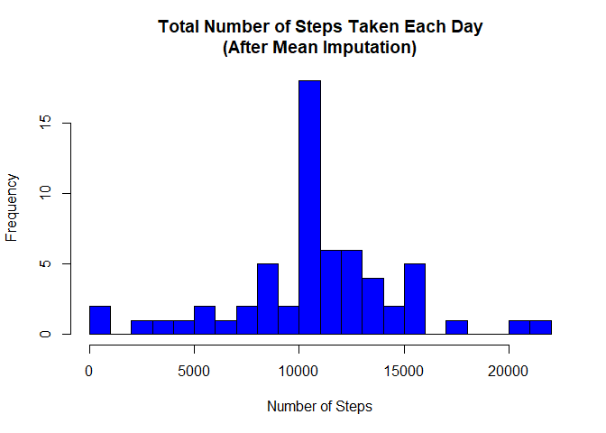

## Introduction
It is now possible to collect a large amount of data about personal movement using activity monitoring devices such as a Fitbit, Nike Fuelband, or Jawbone Up. These type of devices are part of the “quantified self” movement – a group of enthusiasts who take measurements about themselves regularly to improve their health, to find patterns in their behavior, or because they are tech geeks. But these data remain under-utilized both because the raw data are hard to obtain and there is a lack of statistical methods and software for processing and interpreting the data.

This project makes use of data from a personal activity monitoring device. This device collects data at 5 minute intervals through out the day. The data consists of two months of data from an anonymous individual collected during the months of October and November, 2012 and include the number of steps taken in 5 minute intervals each day.

The data for this project can be downloaded from this repository.

## Loading and Preprocessing the Data

#### 1. Set the working directory.


```r
#setwd(dir="~/R/RepData_PeerAssessment1")
```

#### 2. Download the activity file.


```r
library(data.table)
fileURL="https://d396qusza40orc.cloudfront.net/repdata%2Fdata%2Factivity.zip"
if(!file.exists("activity.zip")) {
  download.file(fileURL, destfile="activity.zip")
  unzip("activity.zip")
}
```

#### 3. Load and preprocess the data.

Loading neccessary packages

```r
library(dplyr)
```

```
## 
## Attaching package: 'dplyr'
```

```
## The following objects are masked from 'package:data.table':
## 
##     between, first, last
```

```
## The following objects are masked from 'package:stats':
## 
##     filter, lag
```

```
## The following objects are masked from 'package:base':
## 
##     intersect, setdiff, setequal, union
```

```r
library(ggplot2)
```


```r
tab <-
  read.csv("activity.csv",stringsAsFactors=FALSE) %>%
  mutate(date=as.Date(date,"%Y-%m-%d"))
```

## What is the mean total number of steps taken per day

#### 1. Calculate the number of steps per day

```r
totSteps_day <- aggregate(steps~date,tab,sum)
```


```
##          date steps
## 1  2012-10-02   126
## 2  2012-10-03 11352
## 3  2012-10-04 12116
## 4  2012-10-05 13294
## 5  2012-10-06 15420
## 6  2012-10-07 11015
## 7  2012-10-09 12811
## 8  2012-10-10  9900
## 9  2012-10-11 10304
## 10 2012-10-12 17382
```

#### 2. Make a histogram of the total number of steps taken each day using base plot system.

```r
hist(totSteps_day$steps,
     breaks=20, 
     main="Total Number of Steps Taken Each Day",
     col="red",
     xlab="Number of Steps")
```

<!-- -->

#### 3. Calculate and Report the mean and median of the total steps per day.

```r
totSteps_day_mean <- mean(totSteps_day$steps)
totSteps_day_mean
```

```
## [1] 10766.19
```

```r
totSteps_day_median <- median(totSteps_day$steps)
totSteps_day_median
```

```
## [1] 10765
```

## What is the average daily activity pattern?

#### 1. Make a time series plot (i.e. type="l") of the 5-minute interval (x-axis) and the average number of steps taken, averaged across all days (y-axis) using the base plotting system.

```r
avgStep_interval <- aggregate(steps ~ interval,tab,mean)
plot(avgStep_interval$interval,
     avgStep_interval$steps,
     type="l",
     col="blue",
     main="Average Number of Steps Taken per Day \n in each 5-minute interval",
     xlab="5-Minute Interval",
     ylab="Number of Steps")
```

<!-- -->

#### 2. Find the 5-minute interval, on average across all the days in the dataset, (which) contains the maximum number of steps.

```r
maxSteps_interval <- avgStep_interval[which.max(avgStep_interval$steps),1]
maxSteps_interval
```

```
## [1] 835
```

So the "835" 5-minute Interval contains the maximum number of steps.

## Imput Missing Values

#### 1. Calculate and report the number of missing values

First, what the raw date looks like:


```
##    steps       date interval
## 1     NA 2012-10-01        0
## 2     NA 2012-10-01        5
## 3     NA 2012-10-01       10
## 4     NA 2012-10-01       15
## 5     NA 2012-10-01       20
## 6     NA 2012-10-01       25
## 7     NA 2012-10-01       30
## 8     NA 2012-10-01       35
## 9     NA 2012-10-01       40
## 10    NA 2012-10-01       45
```


```r
sum(is.na(tab$steps))
```

```
## [1] 2304
```

So there are 2304 missing values in the `steps` column.

#### 2. Devise a strategy for filling in all of the missing values in the dataset. Create a new dataset that is equal to the original dataset but with the missing data filled in.

I will be using mean imputation.
To accomplish this I will take the average of the all the average steps-per-interval that were taken previously to replace all the NA values.


```r
newTab <-
  tab %>%
  mutate(steps=replace(steps,is.na(steps),mean(avgStep_interval$steps)))
new_totSteps <- aggregate(steps~date,newTab,sum)
```

Here's what the data looks like after mean imputation:

```
##      steps       date interval
## 1  37.3826 2012-10-01        0
## 2  37.3826 2012-10-01        5
## 3  37.3826 2012-10-01       10
## 4  37.3826 2012-10-01       15
## 5  37.3826 2012-10-01       20
## 6  37.3826 2012-10-01       25
## 7  37.3826 2012-10-01       30
## 8  37.3826 2012-10-01       35
## 9  37.3826 2012-10-01       40
## 10 37.3826 2012-10-01       45
```

#### 3. Make a histogram of the total number of steps taken each day and calculate and report the mean and median total number of steps taken per day. Do these values differ from the estimates from the first part of the assignment? What is the impact of imputing missing data on the estimates of the total daily number of steps?


```r
hist(new_totSteps$steps,
     breaks=20,
     main="Total Number of Steps Taken Each Day\n(After Mean Imputation)",
     col="blue",
     xlab="Number of Steps")
```

<!-- -->

Here are the mean and median of the total steps-per-day after mean imputation has been performed:


```r
newSteps_mean <- mean(new_totSteps$steps)
newSteps_mean
```

```
## [1] 10766.19
```

```r
newSteps_median <- median(new_totSteps$steps)
newSteps_median
```

```
## [1] 10766.19
```

dataset| Mean | Median
------- | ------- | -------
raw | 10766.19 | 10765
imputed | 10766.19 | 10766.19

It can be seen that if we use the average of the average steps-per-interval to perform mean imputation, there is almost no impact on the estimates of the total number of steps-per-day.


## Are there differences in activity patterns between weekdays and weekends?

#### 1. Create a new factor variable in the dataset with two levels - "weekday" and "weekend" indicating whether a given date is a weekday or weekend day.


```r
newTab <-
        mutate(newTab,days=weekdays(date)) %>%
        mutate(days=ifelse(days %in% c("Satuday","Sunday"),"Weekend","Weekday"))
```

Here's how what the data looks like with the new variable:


```
##      steps       date interval    days
## 1  37.3826 2012-10-01        0 Weekday
## 2  37.3826 2012-10-01        5 Weekday
## 3  37.3826 2012-10-01       10 Weekday
## 4  37.3826 2012-10-01       15 Weekday
## 5  37.3826 2012-10-01       20 Weekday
## 6  37.3826 2012-10-01       25 Weekday
## 7  37.3826 2012-10-01       30 Weekday
## 8  37.3826 2012-10-01       35 Weekday
## 9  37.3826 2012-10-01       40 Weekday
## 10 37.3826 2012-10-01       45 Weekday
```

#### 2. Make a panel plot containing a time series plot (i.e. type="l") of the 5-minute interval (x-axis) and the average number of steps taken, averaged across all weekday days or weekend days (y-axis).

## First we'll separate the data between Weekdays and Weekends to calculate the average steps per interval in each group.


```r
avgStep_interval_wday <- filter(newTab,days=="Weekday")
avgStep_interval_wday <- aggregate(steps ~ interval,avgStep_interval_wday,mean)
avgStep_interval_wday <-
        avgStep_interval_wday %>%
        mutate(days=rep("Weekday",length(avgStep_interval_wday$interval)))

avgStep_interval_wknd <- filter(newTab,days=="Weekend")
avgStep_interval_wknd <- aggregate(steps ~ interval,avgStep_interval_wknd,mean)
avgStep_interval_wknd <-
        avgStep_interval_wknd %>%
        mutate(days=rep("Weekend",length(avgStep_interval_wknd$interval)))
```

## Now we'll merge the two groups of data into one dataset and use ggplot2 to make a plot demonstrating the differences between the two groups.


```r
newTab_days <- bind_rows(avgStep_interval_wday,avgStep_interval_wknd)

ggplot(newTab_days,aes(interval,steps,color=days))+geom_line()+
        facet_wrap(~days,ncol=1,nrow=2)+
        xlab("Interval")+ylab("Number of Steps")
```

<!-- -->

We can see a clear difference in the patterns between the two groups. We can see that for weekdays more steps were observed within the 500 and 1000 intervals than any other intervals. In contrast, for Weekends the number of steps observed is more evenly distributed overall.
